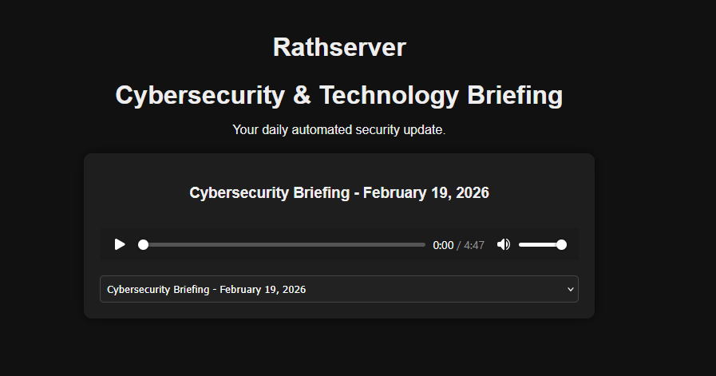

# 📰 Cyber Brief – Automated AI Podcast Generator

An automated cybersecurity news podcast built using Python, RSS feeds, and AI text-to-speech.

## 🚀 Features

- Pulls top cybersecurity headlines from RSS feeds
- Uses AI TTS to generate a spoken news briefing
- Exports daily MP3 podcast
- Automatically generates valid RSS XML feed
- Hosted via Nginx on Raspberry Pi through Cloudflare Tunnel
- Includes a web landing page with dynamic episode player

## 🧠 Tech Stack

- Python
- feedparser
- edge-tts
- pydub
- systemd
- Nginx
- Cloudflare Domain and Tunnel
- HTML + JavaScript (RSS parsing)

## 🖥️ Architecture

RSS Feeds → Python Script → AI TTS → MP3 → RSS XML → Web Hosting → Podcast Clients

## 📦 Installation

1. Clone repo
2. Install requirements:
   pip install -r requirements.txt
3. Configure RSS sources
4. Run:
   python generate_podcast.py

## 🔄 Automation

Uses systemd service to generate podcast daily.

Built as a portfolio project demonstrating automation, AI integration, and full-stack deployment.